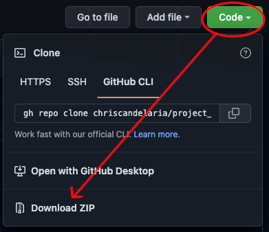

# project_stata_example

This introduction to Robert Picard's `project` (for Stata) is a work in progress. I welcome any feedback or suggestions. 

## Install `project`

`project` is a suite a of project management commands created by Robert Picard. To use these commands, you first need to install `project`. 

#### Stata 16 and above

Install `project` by entering the following line of code at the command prompt in Stata 16 or higher:  
`net install project, from(https://github.com/chriscandelaria/project_stata/raw/main)`.  
This version of `project` (above) is forked from [Michael Stepner's Github page](https://github.com/michaelstepner/project_stata). Michael updated Picard's `project` with several useful features, taking advantage of frames and Python introduced in Stata 16. 

#### Stata 15 and below

If you are using of version of Stata below 16, then please download the project files directly from [Picard's website](http://robertpicard.com/stata/project.zip). 

After unzipping the files, you should place the three files in your personal ado directory. 

## Read the help file

The `project` help file contains a wealth of information. Assuming this is your first time using `project`, skim the help file by typing `help project` at the Stata command prompt. Then proceed with the example below.

## Using `project`: An example

The following steps will get you started with `project`:

1. I created a sample project folder, `sample_project`, which enables one to use `project`. As shown in the figure below, download this folder by left-clicking "Code" (at the top of this page) and selecting "Download ZIP."

	

2. Extract the .zip file to a location of your choosing on your hard drive. The main folder of interest is `sample_project`.

3. Launch Stata, if not already opened, and type `project, setup` at the command prompt.

4. Using the GUI dialogue box, select the location of the main `.do` file, which is called `project_starter.do` in the `sample_project` folder. Then select which options you would like to enforce with this project. Typically, you might prefer `.smcl` log files---the default---if your project team members all work with Stata; however, for wide public distribution, a text `.log` file would be preferable. Also, I typically relax dependency checks for files over 100 MB, but you can experiment with a larger or smaller file size. The following figure shows how the dialogue box appears:

	

5. Once you have set up the project, type `project project_starter, build` to perform a build of the project. Please note that the project name `project_starter` is determined by the main `.do` file's name that you selected in step 4. Every time you want to run a `.do` file for the project, you will type `project project_starter, build`. If none of the associated project `.do` files nor the associated data files on which they depend change, these `.do` files will be skipped, saving you valuable time. 

6. Experiment with the sample project. I highly recommend reading the comments in `project_starter.do` for additional guidance. Then, of course, carefully read the `project` help file. Feel free to inspect and examine all of the associated project `.do` files as well.

